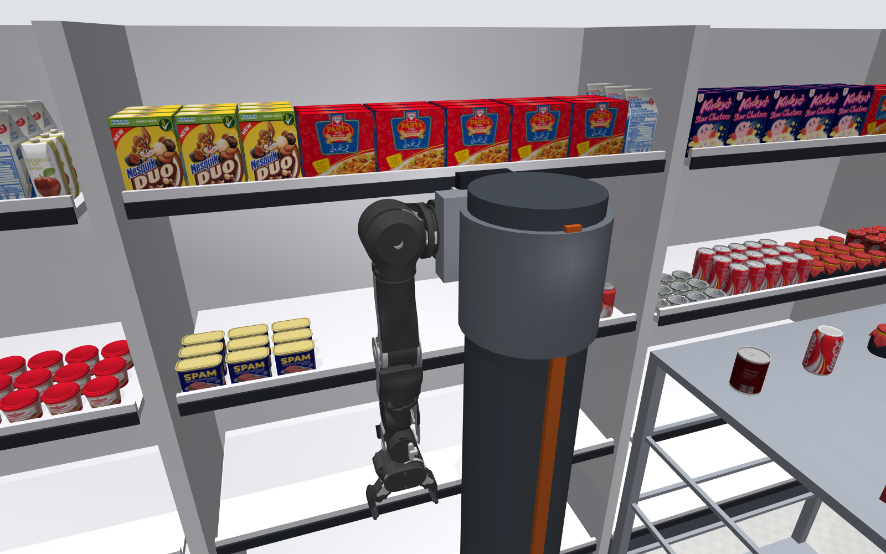
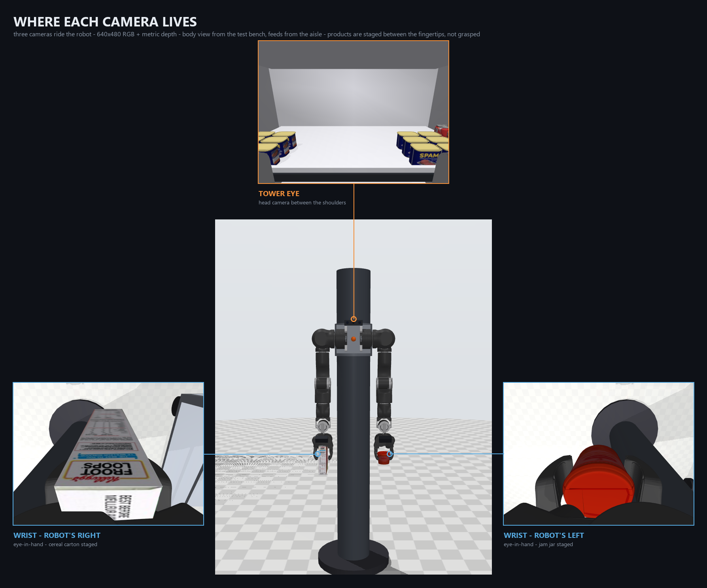
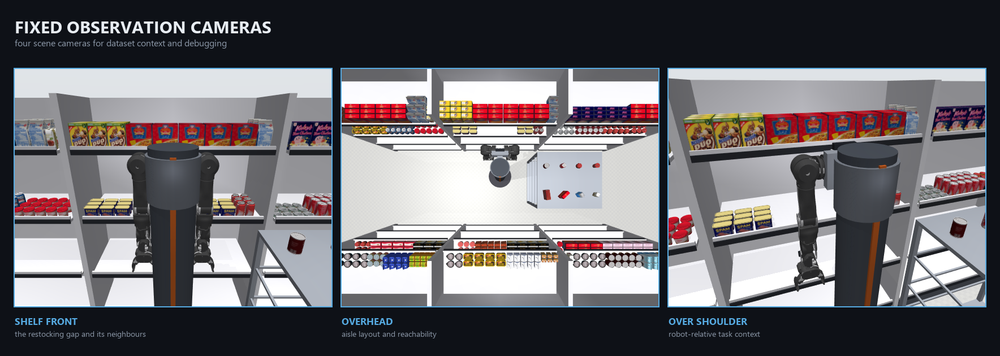

<h1 align="center">Dual-Arm Supermarket</h1>

<p align="center">
  <strong>A MuJoCo shelf-restocking environment for bimanual VLA data collection.</strong><br>
  Two gondola runs, 364 real scanned products, a lift tower carrying an OpenArm v2 pair,<br>
  and seven cameras — four fixed, three riding the robot.
</p>

<p align="center">
  
  
  
  
</p>

<p align="center">
  
</p>

> [!IMPORTANT]
> **This is a simulator, not a dataset.** No episodes have been recorded. Every
> image here is an inspection render produced by
> [`tools/make_figures.py`](tools/make_figures.py), not training data. The
> recording loop is deliberately not implemented — see
> [Toward collection](#toward-collection).

---

## What this is

A supermarket aisle you can open, drive, and grab things in. The task it is
built around is **restocking**: a run of facings on one deck is deliberately
left empty, a roll cage of loose product stands in the aisle, and a two-armed
robot on a rotating, rising tower sits between them.

Everything is generated from Python, so the layout, product mix, gap position
and reachability budget are parameters rather than hand-placed geometry.

```
out/scene.xml  ──attach at tower_base_site──▶  tower.xml
                                                  │
                                                  └──attach at arm_mount, +90° yaw──▶  OpenArm v2
```

The robot never exists on disk. `scene.py` writes the environment; `robot.py`
joins the scene, the tower and the arm **in memory** with `MjSpec` and compiles
them together. That is why there is no single "scene with robot" XML.

---

## The scene in numbers

<table>
<tr><td valign="top" width="50%">

**Gondola** — real supermarket dimensions

| | |
|---|---|
| bay length | 1.25 m |
| bays per run | 3 → **3.75 m** |
| runs | 2, facing each other |
| aisle width | 1.30 m |
| shelf depth | 0.47 m |
| rack height | 1.80 m |
| deck heights | 0.15 / 0.60 / 1.05 / 1.50 m |
| stocked decks | 1.05 and 1.50 |
| restocking gap | **420 mm**, deck 2 |

</td><td valign="top" width="50%">

**Robot** — tower + OpenArm v2

| | |
|---|---|
| actuators | **18** (16 arm + 2 base) |
| tower yaw | hinge, ±180°, error ≤ **0.0002°** |
| tower lift | slide, 0–0.70 m, sag **≤ 1.74 mm** |
| shoulder standoff | 190 mm off the column axis |
| shoulder clearance | 108.4 mm |
| reach | 0.589 m from the shoulder |
| hands at home | 436.00 mm below the mount |
| mirror error | **0.0000 mm** at spawn, 0.045 mm after 3 s |

</td></tr>
</table>

**Interaction budget** — 364 products, but only some can move. This is
deliberate: a free body the arm cannot reach costs solver time and buys nothing.

| tier | count | joint | collides | why |
|---|---:|---|---|---|
| near-run front row, within reach | 21 | `freejoint` | yes | the pick/place targets |
| roll-cage stock | 8 | `freejoint` | yes | the restocking source |
| near-run back rows | 177 | none | yes | look right, block the gripper, cost nothing |
| far run, across the aisle | 158 | none | **no** | 0.85 m away, outside reach — render-only scenery |

Dropping the far run's colliders and gating `freejoint` on reach took the scene
from 1.87× to **5.0× realtime**.

---

## Cameras

<p align="center">
  
</p>

<p align="center"><sub>
Tower eye sits above the head it is bolted to; each wrist feed sits beside its own arm.
Front view, so the robot's left arm appears on your right.
</sub></p>

Three cameras ride the robot and move with it. `tower_eye` is a RealSense-shaped
bar mounted on the shoulder plate between the arms; the two wrist cameras are
eye-in-hand. All render **640×480 RGB, plus metric depth** from the same pose.

| camera | mount | fovy | framing at home, by segmentation |
|---|---|---|---|
| `tower_eye` | carriage, between the shoulders | 75° | 7.7% product, 89.4% shelf, **2.9% arm** |
| `camera_wrist_left/right` | `ee_base_link` | 60° | **11.3% fingers** centred at frame row 0.74, 11.9% other arm |

`tower_eye` sits 260 mm from the shelf face, so the deck fills most of the frame
whatever the angle — the 89% is the bay it is working on, not wasted view. Both
wrist cameras measure identically, which is the check that the mirror is right.

> [!NOTE]
> The wrist views are **framing-correct but not yet interesting**: at the
> `qpos=0` home the arms hang straight down with nothing in the gripper, so they
> show forearm, fingers and floor. They frame product once an arm is raised.

<p align="center">
  
</p>

<p align="center"><sub>
Fixed cameras do not move with the robot. All figures are generated by
<a href="tools/make_figures.py"><code>tools/make_figures.py</code></a>.
</sub></p>

Four fixed cameras — `aisle`, `shelf_front`, `overhead`, `over_shoulder` — give
dataset context and debugging views that do not move with the robot.

```python
from pathlib import Path
from robot import build, render_rgbd

bot = build()
info = render_rgbd(bot.model, bot.data, "tower_eye", Path("out/shots"))
# -> tower_eye_rgb.png, tower_eye_depth.npy (float32 metres), tower_eye_depth.png
```

---

## The test bench

The body view in the figure above is rendered here, not in the shop: a full
front view is impossible inside a 1.30 m aisle because the camera cannot get
far enough back.

The full aisle is a bad place to test joints — 392 bodies, slow to render, and
the shelves physically obstruct the slew. `bench.py` brings up the tower and
arms on a bare floor: **24 bodies, 107 geoms**, instant to render, with the
actuator sliders enabled by default.

```bash
python bench.py           # sliders on; Ctrl+drag to move a joint
python bench.py --sweep   # scripted yaw/lift sweep, prints tracking error
```

It goes through the same `robot.assemble()` path as the aisle, so what you drive
here is the model that ends up in the shop.

---

## Quick start

```bash
python scene.py           # regenerate out/scene.xml
python view.py            # aisle only
python view.py --robot    # aisle + robot
python bench.py           # robot alone, with sliders
python live.py            # viewer + one live window per on-board camera
```

<details>
<summary><strong>Windows: if <code>python</code> is not the right interpreter</strong></summary>

The prompt showing `(shelf_sim)` means the environment is already active — you
do not need `conda activate`. Otherwise call the interpreter directly:

```
"C:/Users/shubh/anaconda3/envs/shelf_sim/python.exe" view.py --robot
```

In `cmd.exe`, changing drive needs `/d`: `cd /d "D:\New folder\da_supermarkt"`.
`conda activate shelf_sim && python bench.py` are two commands — the `&&`
matters.
</details>

### Install

Conda:

```bash
conda env create -f environment.yml
conda activate shelf_sim
```

or pip, with Python 3.11:

```bash
python -m venv .venv
.venv/Scripts/activate          # Windows;  source .venv/bin/activate elsewhere
pip install -r requirements.txt
```

Five pinned packages: `mujoco` 3.13.0, `openarm_mujoco` 2.2.0, `numpy` 2.4.6,
`imageio` 2.37.4, `pillow` 12.3.0. `tkinter`, used by `live.py`, ships with
CPython. **CPU only by design** — no Torch, JAX, Warp or CUDA anywhere.

`robocasa` is deliberately **not** a dependency, and installing it breaks this
environment — [`requirements.txt`](requirements.txt) explains why and what to do
if you ever need to rebuild the assets.

Nothing else is needed: `assets/products/` is committed, so a fresh clone runs
without downloading anything. Verify the install with:

```bash
python scene.py && python tools/verify_products.py && python bench.py --sweep
```

Viewer flags, performance numbers and troubleshooting live in
[`docs/VIEWER.md`](docs/VIEWER.md).

---

## Controlling the robot

`robot.build()` returns a handle that commands the base and the arms
independently — which is what a collection script needs.

```python
from robot import build

bot = build()
bot.set_base(yaw=1.57, lift=0.70)   # radians, metres — clipped to ctrlrange
yaw, lift = bot.get_base()          # measured, not commanded
bot.set_arm("left", q)              # 7 joint targets
bot.set_gripper("right", 1.0)       # 0 = closed, 1 = fully open
bot.home()                          # qpos=0 arms, mid-lift, grippers open
```

**The two arms are mirrored.** `RobotSpec.mirror` is `(-1,-1,-1,1,-1,-1,-1)`;
one posture is stored and the right arm is that pattern times it. Sending both
arms the same angles looks fine and is wrong — the joint limits are asymmetric
(`left_joint1` spans −200…+80°, `right_joint1` −80…+200°).

**Gripper**, measured rather than assumed: `ctrlrange` is `[0, 0.7854]` on the
left and `[-0.7854, 0]` on the right, and the open end is whichever is further
from zero — verified by jaw separation, which runs **91.0 mm closed → 154.6 mm
open**. Maximum graspable width is **138.6 mm**, found by bisection with a
0.54 kg box. All eight product categories fit, widest being a 72 mm milk carton.

---

## Products

Eight shelf-stable categories, 79 instances, 214.9 MB of scanned geometry.
Masses are **not** the source defaults: RoboCasa ships everything at
`density=100 kg/m³`, so each category is re-derived from its measured mesh
volume at a plausible gross density and checked against a per-family band.

| category | family | mass | implied density |
|---|---|---:|---:|
| `boxed_food` | dry carton | 0.35 kg | 420 |
| `cereal` | dry carton | 0.09 kg | 152 |
| `boxed_drink` | liquid carton | 0.25 kg | 1175 |
| `milk` | liquid carton | 0.54 kg | 1029 |
| `canned_food` | cylinder | 0.31 kg | 1290 |
| `can` | cylinder | 0.35 kg | 1163 |
| `jam` | cylinder | 0.28 kg | 1381 |
| `yogurt` | cylinder | 0.20 kg | 1074 |

Bands are enforced in [`tools/verify_products.py`](tools/verify_products.py) and
exit non-zero on violation: dry cartons 80–700, liquid cartons 900–1250,
cylinders 900–1500 kg/m³. Cereal is mostly air, which is why it sits at 152.

**Rendering and collision are separate.** Products keep their full scanned mesh
for the camera and collide as a box or cylinder fitted to their measured
bounding box. Two meshes alone — `canned_food_9` at 175k vertices and
`yogurt_3` at 116k — are 73% of the scene's geometry; colliding through their
convex hulls dropped the scene to 1.9× realtime.

---

## Asset provenance

Record which bucket an asset came from when publishing anything derived from
this repo.

| asset | source | licence |
|---|---|---|
| Product meshes | [RoboCasa](https://github.com/robocasa/robocasa) `objs_objaverse` pack, extracted into `assets/products/` | [MIT](https://github.com/robocasa/robocasa/blob/main/LICENSE) |
| Upstream of those meshes | [Objaverse](https://objaverse.allenai.org/) via RoboCasa | ODC-By 1.0 |
| Bimanual arm | [`openarm_mujoco`](https://github.com/enactic/openarm_mujoco) v2.2.0, resolved from the installed package — **not** vendored here | Apache-2.0 |
| Lift tower | [`tower.xml`](tower.xml) — hand-authored in this repo | this repo |
| Aisle, shelves, roll cage | generated by [`scene.py`](scene.py) | this repo |
| Physics engine | [MuJoCo](https://github.com/google-deepmind/mujoco) 3.13.0 | Apache-2.0 |

This project itself is **Apache-2.0** — see [`LICENSE`](LICENSE), with
third-party attribution in [`NOTICE`](NOTICE). Both upstream licences (MIT and
Apache-2.0) are permissive and compatible with it.

<details>
<summary><strong>How the products were obtained</strong></summary>

`tools/build_products.py` extracts eight categories from RoboCasa's objaverse
archive, resolving the download URL from RoboCasa's own
`box_links_assets.json`. Mesh paths are rewritten relative so the scene has no
runtime dependency on RoboCasa. Verified self-contained: 761 mesh/texture
references, 0 missing, 0 pointing outside `assets/products/`.

Two notes for anyone reproducing this:

- RoboCasa's `download_kitchen_assets.py` probes with an HTTP **HEAD** request,
  and the Box host answers 404 to HEAD while serving GET normally — the script
  reports the host as unreachable when it is fine.
- `pip install -e robocasa` pins `mujoco==3.3.1` and pulls Torch via
  `lerobot`/`tianshou`. This project never installs it; the registry is read by
  `ast`-parsing `kitchen_objects.py`.

The eight categories are all `graspable=True` upstream. `peanut_butter` exists
only in the AI-generated pack, so `yogurt` is used in its place.
</details>

---

## Source of truth

| path | role | edit? |
|---|---|---|
| [`scene.py`](scene.py) | aisle generator — all dimensions are dataclasses | **yes** |
| [`robot.py`](robot.py) | runtime assembly, `Robot` handle, RGB-D | **yes** |
| [`tower.xml`](tower.xml) | hand-authored base MJCF — `scene.py` never writes it | **yes** |
| [`bench.py`](bench.py) · [`view.py`](view.py) · [`live.py`](live.py) | entry points | **yes** |
| [`tools/`](tools/) | asset build, verification, figures | **yes** |
| `out/scene.xml`, `out/bench.xml` | generated MJCF, committed so it opens from a clone | no — rerun the script |
| `docs/figures/*.png` | README figures | no — `python tools/make_figures.py` |
| `robocasa/` | upstream clone, gitignored — only needed to rebuild assets | no |

**Committed deliberately:** `assets/products/` (211 MB) so the scene runs from a
clone with no downloads — the upstream asset host has already proven flaky — and
`out/scene.xml` / `out/bench.xml`, which are generated but deterministic (the
generator is seeded), small, and openable in any MuJoCo viewer straight from a
clone. Committing them also makes a scene change show up as a reviewable diff.

**Gitignored:** `robocasa/` (81 MB, and a nested `.git` that cannot be committed
as files), `.venv/`, depth arrays, scratch renders in `out/shots/`, and
`MUJOCO_LOG.TXT` — a runtime log MuJoCo drops in the working directory.

> [!WARNING]
> `out/scene.xml` refers to meshes by a path relative to itself
> (`meshdir="../assets/products"`). It only resolves from inside `out/`.
> Copying it elsewhere breaks every mesh.

---

## Toward collection

The recorder is intentionally not implemented — the simulator provides
deterministic state and camera output for an external writer such as
[LeRobot](https://github.com/huggingface/lerobot). Use a **passive** loop, not
the managed viewer; that is where a policy or teleoperator goes:

```python
import mujoco, mujoco.viewer
from robot import build

bot = build()
with mujoco.viewer.launch_passive(bot.model, bot.data) as viewer:
    while viewer.is_running():
        bot.set_base(yaw, lift)          # your controller here
        mujoco.mj_step(bot.model, bot.data)
        viewer.sync()
```

Per step, store observation and action under one timestamp: RGB (and optionally
depth) per camera, `qpos`/`qvel`, `ctrl`, episode and frame index, task string,
and the reset seed.

**Before recording anything:**

1. `python scene.py` — regenerate the aisle.
2. `python tools/verify_products.py` — mass bands must pass.
3. `python bench.py --sweep` — yaw error ≤ 0.0002°, lift sag ≤ 1.74 mm.
4. `python live.py` — check all three on-board views.
5. Confirm targets are in the dynamic front row or the roll cage, not static stock.
6. `bot.home()` and verify both grippers travel.
7. Record code revision, asset set, camera names, image size, timestep and
   randomisation parameters.

### Known gaps

- **No recorder, no episodes.** Nothing has been collected.
- **Wrist views are empty at home.** Correct framing, nothing to look at until
  an arm is raised.
- **Only 29 of 364 products are manipulable**, in a band around the robot. If a
  task needs an arbitrary product, promote it to `freejoint` at generation time
  and regenerate, rather than making everything dynamic.
- **The shipped OpenArm gripper self-collides.** Its two jaw bodies overlap at
  the knuckle and the MJCF declares an empty `<contact>` block, so the left
  gripper pins at its 7 N·m limit and will not open. `robot.py` adds the missing
  `<contact><exclude>` per side at assembly time. Worth reporting upstream.

---

<p align="center"><sub>
Apache-2.0 ·
Built with <a href="https://github.com/google-deepmind/mujoco">MuJoCo</a> ·
arm by <a href="https://github.com/enactic/openarm_mujoco">Enactic</a> ·
products from <a href="https://github.com/robocasa/robocasa">RoboCasa</a>
</sub></p>
