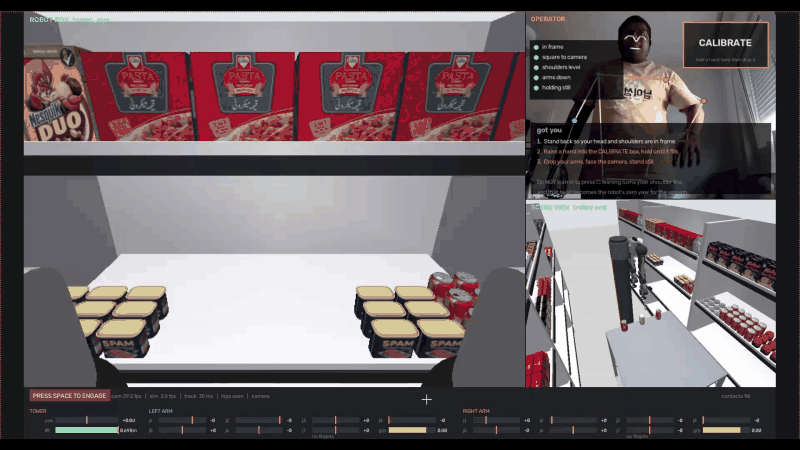
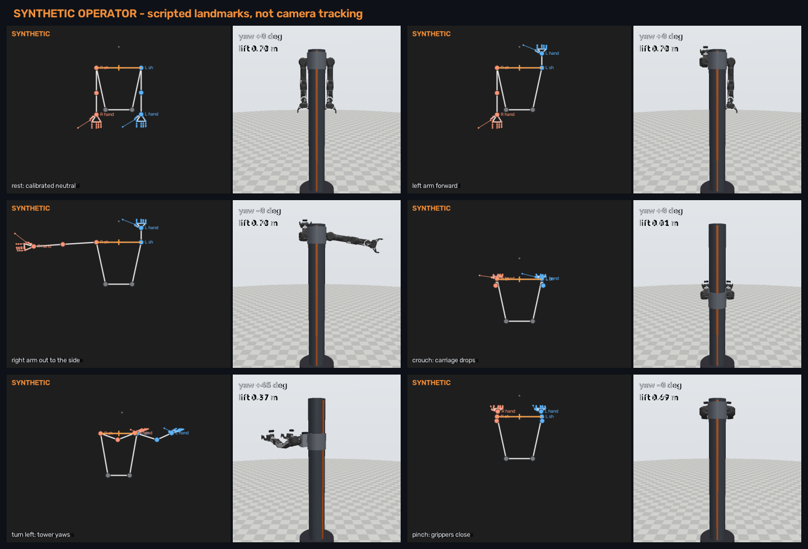
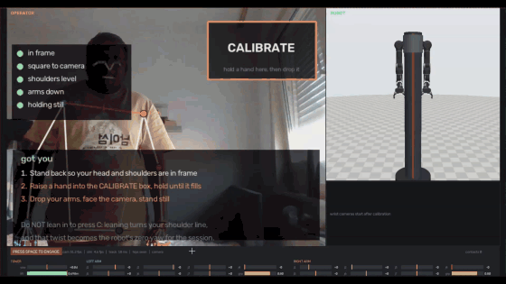

<h1 align="center">Dual-Arm Supermarket</h1>

<p align="center">
  <strong>A MuJoCo shelf-restocking environment for bimanual robot learning, with camera-based teleoperation.</strong><br>
  Two gondola runs of real scanned products, a lift tower carrying an OpenArm v2 pair,<br>
  cameras on the robot and around the aisle, and a webcam teleop pipeline to drive it.
</p>

<p align="center">
  
  
  
  
</p>

<p align="center">
  
</p>

The repository has two parts, and this README follows them:

| | part | what you get | start here |
|---|---|---|---|
| **1** | [**Simulation: scene, assets, robot**](#part-1--simulation) | the aisle, 359 products, the tower + arms, cameras, a Python API | `python view.py --robot` |
| **2** | [**Teleoperation**](#part-2--teleoperation-under-development) | drive the robot with your body through a webcam, in the empty bench or the aisle | `python -m teleop --scene aisle --camera 0` |

> [!IMPORTANT]
> **This is a simulator, not a dataset.** No training episodes have been
> recorded, and teleoperation is still under development.

---

## Install (both parts)

```bash
conda env create -f environment.yml
conda activate shelf_sim
python scene.py && python tools/verify_products.py && python bench.py --sweep   # check it works
```

Teleoperation needs two more packages, kept out of `requirements.txt` because
the simulator does not need them. Both install without moving the pinned
`numpy` or `mujoco`:

```bash
pip install mediapipe==1.0.1 opencv-python==5.0.0.93
```

<details>
<summary><strong>pip instead of conda, and Windows notes</strong></summary>

With Python 3.11:

```bash
python -m venv .venv
.venv/Scripts/activate          # Windows;  source .venv/bin/activate elsewhere
pip install -r requirements.txt
```

Five pinned packages: `mujoco` 3.13.0, `openarm_mujoco` 2.2.0, `numpy` 2.4.6,
`imageio` 2.37.4, `pillow` 12.3.0. **CPU only by design.** `assets/products/` is
committed, so a clone runs without downloading anything. `robocasa` is
deliberately **not** a dependency - installing it breaks this environment; see
[`requirements.txt`](requirements.txt).

If `python` is not the env's interpreter, call it directly:
`"C:/Users/<you>/anaconda3/envs/shelf_sim/python.exe" view.py --robot`.
In `cmd.exe`, changing drive needs `/d`: `cd /d "D:\New folder\da_supermarkt"`.
</details>

---

# Part 1 — Simulation

## 1.1 Run it

```bash
conda activate shelf_sim
python scene.py              # (re)generate the aisle -> out/scene.xml
python view.py               # aisle only
python view.py --robot       # aisle + robot
python bench.py              # robot alone on an empty floor, joint sliders
python bench.py --sweep      # scripted yaw/lift sweep, prints tracking error
python live.py               # viewer + a live window per on-board camera
```

Use **`bench.py`** to test joints: 24 bodies instead of ~390, instant to
render, nothing in the way of the arms. It builds the robot through the same
code path as the aisle, so what you test there is what ends up in the shop.

Viewer flags, performance numbers and troubleshooting: [`docs/VIEWER.md`](docs/VIEWER.md).

## 1.2 How it fits together

```
scene.py  ──writes──▶  out/scene.xml  ──attach at tower_base_site──▶  tower.xml
                                                                        │
                                          OpenArm v2 ◀──attach at arm_mount, +90° yaw──┘
```

`scene.py` generates the environment: every dimension, the product mix and the
restocking gap are dataclass parameters, not hand-placed geometry. `robot.py`
joins scene, tower and arms **in memory** with `MjSpec`, which is why there is
no single "scene with robot" XML on disk.

| path | role |
|---|---|
| [`scene.py`](scene.py) | aisle generator - edit dimensions here, then rerun it |
| [`tower.xml`](tower.xml) | hand-authored lift tower (rotary base + 0.70 m slide) |
| [`robot.py`](robot.py) | assembly, the `Robot` handle, RGB-D rendering |
| [`bench.py`](bench.py) · [`view.py`](view.py) · [`live.py`](live.py) | entry points |
| [`tools/`](tools/) | asset build, verification, figures |
| `assets/products/` | scanned product meshes, committed |
| `out/scene.xml`, `out/bench.xml` | generated, committed so they open from a clone - **rerun the script, do not edit** |

> [!WARNING]
> `out/scene.xml` finds its meshes by a path relative to itself
> (`meshdir="../assets/products"`). Copying it elsewhere breaks every mesh.

## 1.3 The scene

| gondola (real supermarket dimensions) | |
|---|---|
| runs | 2, facing across a **1.30 m** aisle |
| bays per run | 3 × 1.25 m = **3.75 m** |
| shelf depth / rack height | 0.47 m / 1.80 m |
| decks | 0.15 / 0.60 / 1.05 / 1.50 m; stock on 1.05 and 1.50 |
| restocking gap | **420 mm** empty on deck 2, in front of the robot |
| roll cage | tray at 0.90 m in the aisle beside the robot, **3 loose items** spaced 18 cm apart |

**Only reachable products can move.** A free body the arm cannot reach costs
solver time and buys nothing:

| tier | count | moves | collides |
|---|---:|---|---|
| near-run front row, within reach | 21 | yes | yes |
| roll-cage stock | 3 | yes | yes |
| near-run back rows | 177 | no | yes |
| far run, across the aisle | 158 | no | no - scenery |

## 1.4 The robot

| | |
|---|---|
| actuators | **18** - 2 tower (yaw ±180°, lift 0-0.70 m) + 2 × (7 arm + 1 gripper) |
| placement | 0.55 m out from the shelf face |
| reach | 0.589 m from the shoulder |
| gripper | jaws 91 → 155 mm; grasps up to **138.6 mm** wide (all 8 product categories fit) |

```python
from robot import build

bot = build()
bot.set_base(yaw=1.57, lift=0.70)   # radians, metres - clipped to ctrlrange
yaw, lift = bot.get_base()          # measured, not commanded
bot.set_arm("left", q)              # 7 joint targets
bot.set_gripper("right", 1.0)       # 0 = closed, 1 = fully open
bot.home()
```

Two things that catch people out:

- **The arms are mirrored.** Sending both the same angles looks fine and is
  wrong - joint limits are asymmetric (`left_joint1` −200…+80°, `right_joint1`
  −80…+200°). `RobotSpec.mirror` holds the sign pattern.
- **The gripper's open end differs per side** (`[0, 0.785]` left,
  `[−0.785, 0]` right). `set_gripper` handles it; raw `ctrl` does not.

## 1.5 Cameras

<p align="center">
  
</p>

| camera | where | notes |
|---|---|---|
| `tower_eye` | on the carriage, between the shoulders; moves with the robot | 75° fov, pitched 20° down so the grippers and the deck are in view |
| `camera_wrist_left/right` | on each gripper | show the fingers; interesting once an arm is raised |
| `aisle`, `shelf_front`, `overhead`, `over_shoulder` | fixed | context and debugging |
| `cage_end` | fixed, past the far end of the roll cage | third-person view of robot, cage and shelf; used by teleop |

All render 640×480 RGB plus metric depth:

```python
from pathlib import Path
from robot import build, render_rgbd

bot = build()
render_rgbd(bot.model, bot.data, "tower_eye", Path("out/shots"))
# -> tower_eye_rgb.png, tower_eye_depth.npy (float32 metres), tower_eye_depth.png
```

## 1.6 Products

Eight shelf-stable categories (`boxed_food`, `cereal`, `boxed_drink`, `milk`,
`canned_food`, `can`, `jam`, `yogurt`), 79 scanned instances from RoboCasa.
Masses are re-derived from each mesh's volume at a realistic density rather
than RoboCasa's flat default, and [`tools/verify_products.py`](tools/verify_products.py)
fails if any falls outside its band. Products **render** their scanned mesh but
**collide** as a fitted box or cylinder, which keeps physics fast.

<details>
<summary><strong>Masses by category</strong></summary>

| category | family | mass | implied density (kg/m³) |
|---|---|---:|---:|
| `boxed_food` | dry carton | 0.35 kg | 420 |
| `cereal` | dry carton | 0.09 kg | 152 |
| `boxed_drink` | liquid carton | 0.25 kg | 1175 |
| `milk` | liquid carton | 0.54 kg | 1029 |
| `canned_food` | cylinder | 0.31 kg | 1290 |
| `can` | cylinder | 0.35 kg | 1163 |
| `jam` | cylinder | 0.28 kg | 1381 |
| `yogurt` | cylinder | 0.20 kg | 1074 |

Bands: dry cartons 80-700, liquid cartons 900-1250, cylinders 900-1500 kg/m³,
defined in [`tools/product_spec.py`](tools/product_spec.py). Cereal is mostly air.
</details>

The mesh simplification that made the aisle cameras usable, and render
timings: [`docs/VIEWER.md`](docs/VIEWER.md#rendering-performance).

---

# Part 2 — Teleoperation (under development)

> [!WARNING]
> **Under development.** The live camera path runs end to end and has been
> used to reach and pick from the roll cage in a few sessions, but it is not
> evaluated and control is still coarse - see [2.4](#24-known-limitations).

<p align="center">
  <a href="docs/media/teleop_live.mp4">
    
  </a>
</p>
<p align="center"><sub>
Live session, phone as webcam. Click for the full-resolution video
(<a href="docs/media/teleop_live.mp4">MP4, 14 s</a>).
</sub></p>

A camera watches you and the robot copies you in MuJoCo:

| you | robot |
|---|---|
| stand / crouch | carriage to the top / lowered |
| turn your shoulders | tower yaws the same way |
| move your arms and wrists | both 7-DOF arms copy shoulder, elbow and wrist |
| pinch thumb to index | that side's gripper closes |

<p align="center">
  
</p>
<p align="center"><sub>The same mapping, one motion at a time, from the scripted operator (<code>--source synthetic</code>).</sub></p>

## 2.1 Run it

**Step 1 - find your camera.** The index changes when a phone is plugged in.

```bash
conda activate shelf_sim
python -m teleop.cameras        # lists cameras with their measured fps
```

**Step 2 - robot only**, to check the mapping (does the arm go where yours goes,
does the tower turn the right way):

```bash
python -m teleop --camera 0 --fullscreen
```

<p align="center">
  <a href="docs/media/teleop_robot_only.mp4">
    
  </a>
</p>
<p align="center"><sub>
Robot only, live, shown at 3× speed. Click for the
<a href="docs/media/teleop_robot_only.mp4">full video (MP4, 48 s)</a>.
</sub></p>

**Step 3 - supermarket shelf**, for pick and place:

```bash
python scene.py                                             # after any scene change
python -m teleop --scene aisle --camera 0 --fullscreen
python -m teleop --scene aisle --camera 0 --fullscreen --record out/pick_try1   # keep a log
```

Everything is in one window. On the shelf: the robot's own camera with both
wrist cameras docked under it, beside your camera and the `cage_end` view. On
the robot-only scene the wrist cameras sit under the robot view. The wrist
tiles start once you have calibrated.

No camera? `python -m teleop --source synthetic` (add `--scene aisle` for the
shelf) runs a scripted operator, and `python -m teleop.selftest` runs 64 checks.

## 2.2 Calibrate, then pick

1. Stand back until your head and shoulders are in frame.
2. **Hold a hand in the CALIBRATE box** (top right) until it fills - no keyboard,
   because leaning to a key twists your shoulders into the calibration.
3. **Drop your arms, face the camera, stand still** for the countdown.
4. To pick from the cage: **turn while standing**, then **crouch** to bring the
   arms down, then pinch. Standing, the grippers pass over the items as the
   tower turns; turning while crouched sweeps them off the tray.

Every option, key and troubleshooting step: [`teleop/README.md`](teleop/README.md).

## 2.3 How it works

| # | stage | file | status |
|---|---|---|---|
| 1 | camera capture on its own thread, auto exposure | `tracking.py` | runs |
| 2 | MediaPipe Holistic: 33 body + 2 × 21 hand landmarks | `tracking.py` | runs |
| 3 | hands-free calibration gated on five pose checks | `quality.py` | runs |
| 4 | closed-form joint angles from torso, arm and palm directions; an arm or hand out of view holds its last pose | `retarget.py` | **verified** against MuJoCo to ~1e-13 |
| 5 | One Euro smoothing, joint limits, rate limits | `filters.py` | verified |
| 6 | position actuators only (`data.ctrl`, never `qpos`) | `simbridge.py` | verified |
| 7 | one window: robot POV, operator, scene view, joint gauges | `overlay.py` | runs |

"Verified" = covered by `teleop.selftest`. Code map and design decisions:
[`teleop/ARCHITECTURE.md`](teleop/ARCHITECTURE.md).

## 2.4 Known limitations

- **The simulator redraws slowly in the aisle** (2-6 fps), so the arm arrives in
  steps and is easy to push into an item. The next thing to fix.
- **It copies posture, not hand position.** Your proportions differ from the
  robot's, so the gripper lands near, not on, where you aim. Precise placement
  needs a Cartesian/IK control mode, which does not exist yet.
- **Torso yaw and wrist roll are the noisiest channels** - both come from
  single-camera depth or a short baseline between landmarks.
- **`--record` logs telemetry for debugging, not training episodes.**

What the pick-and-place sessions measured, which problems come from MediaPipe
and which do not, and what was fixed:
[teleop/README.md](teleop/README.md#what-pick-and-place-sessions-showed-why-control-is-not-precise).

---

# Reference

## Toward data collection

There is no recorder: the simulator provides deterministic state and camera
output for an external writer such as [LeRobot](https://github.com/huggingface/lerobot).
Drive it from a **passive** viewer loop, which is where a policy or teleoperator goes:

```python
import mujoco, mujoco.viewer
from robot import build

bot = build()
with mujoco.viewer.launch_passive(bot.model, bot.data) as viewer:
    while viewer.is_running():
        bot.set_base(yaw, lift)          # your controller here
        mujoco.mj_step(bot.model, bot.data)
        viewer.sync()
```

Per step, store under one timestamp: RGB (and depth) per camera, `qpos`/`qvel`,
`ctrl`, episode and frame index, task string and reset seed. Before recording,
run `python scene.py`, `python tools/verify_products.py`, `python bench.py --sweep`
and `python live.py`, and confirm targets are dynamic (front row or cage).

## Known issues in the simulation

- **Wrist views are empty at the home pose** - correct framing, nothing to see
  until an arm is raised.
- **24 of 359 products are manipulable.** For a task needing another, promote it
  to a free joint in `scene.py` and regenerate rather than making everything dynamic.
- **The shipped OpenArm gripper self-collides** at the knuckle, which pins the
  left gripper shut. `robot.py` adds the missing contact exclusions at assembly.
  Worth reporting upstream.

## Asset provenance and licence

| asset | source | licence |
|---|---|---|
| Product meshes | [RoboCasa](https://github.com/robocasa/robocasa) `objs_objaverse`, extracted into `assets/products/` | [MIT](https://github.com/robocasa/robocasa/blob/main/LICENSE) |
| Upstream of those meshes | [Objaverse](https://objaverse.allenai.org/) via RoboCasa | ODC-By 1.0 |
| Bimanual arm | [`openarm_mujoco`](https://github.com/enactic/openarm_mujoco) v2.2.0, from the installed package | Apache-2.0 |
| Lift tower, aisle, shelves, roll cage | this repo ([`tower.xml`](tower.xml), [`scene.py`](scene.py)) | Apache-2.0 |
| Physics engine | [MuJoCo](https://github.com/google-deepmind/mujoco) 3.13.0 | Apache-2.0 |
| Pose tracking | [MediaPipe](https://github.com/google-ai-edge/mediapipe) (teleop only, not bundled) | Apache-2.0 |

This project is **Apache-2.0** - see [`LICENSE`](LICENSE) and [`NOTICE`](NOTICE).

<details>
<summary><strong>How the products were obtained</strong></summary>

`tools/build_products.py` extracts eight categories from RoboCasa's objaverse
archive, resolving the download URL from RoboCasa's own `box_links_assets.json`,
and rewrites mesh paths so the scene has no runtime dependency on RoboCasa
(761 references, 0 missing). RoboCasa's downloader probes with HTTP HEAD, which
the host answers with 404 while serving GET fine; and `pip install -e robocasa`
pins `mujoco==3.3.1` and pulls Torch, so this project reads its registry by
parsing `kitchen_objects.py` instead. `peanut_butter` exists only in the
AI-generated pack, so `yogurt` is used in its place.
</details>

---

<p align="center"><sub>
Apache-2.0 ·
Built with <a href="https://github.com/google-deepmind/mujoco">MuJoCo</a> ·
arm by <a href="https://github.com/enactic/openarm_mujoco">Enactic</a> ·
products from <a href="https://github.com/robocasa/robocasa">RoboCasa</a>
</sub></p>
