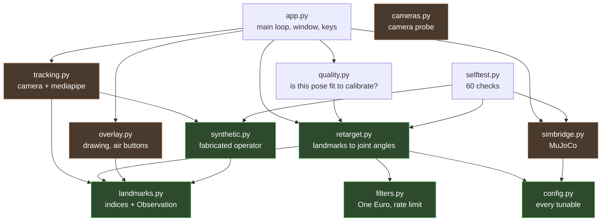

# teleop — how the code fits together

Read this before changing anything. [README.md](README.md) is for *operating*
the teleop; this is for *working on* it.

---

## 1. The one rule the layout exists to enforce

**`retarget.py` imports neither mediapipe nor mujoco.** Everything else follows
from that.

It means the maths that turns a human into joint angles can be checked against
MuJoCo's own forward kinematics with no camera attached, and driven with
fabricated landmarks with no simulator attached. That is the only reason
`selftest.py` can assert 60 things in a few seconds, and the only reason a sign
error in the shoulder solve was caught at all — it produced perfectly smooth,
plausible, *mirrored* motion, which no amount of looking at the window would
have revealed.

If you find yourself wanting to `import mujoco` in `retarget.py`, that is the
signal you are putting something in the wrong file.

---

## 2. Module map



Green = pure numpy, no heavy dependencies, testable anywhere.
Orange = owns a heavy dependency (mediapipe, mujoco or cv2) and is the *only*
file that touches it.

The dependency graph is acyclic and the arrows all point the same way: `app.py`
knows about everything, everything else knows as little as it can.

---

## 3. Data flow

One `Observation` in, one `Targets` out, once per tracked frame.

```
  ┌─────────┐   BGR frame     ┌──────────────┐
  │ camera  │ ──────────────► │ mediapipe    │   holistic_landmarker.task
  └─────────┘                 │ Holistic     │   (own thread, 38 ms/frame)
                              └──────┬───────┘
                                     │  33 pose + 21+21 hand landmarks
                                     ▼
                            ╔════════════════╗
                            ║  Observation   ║   landmarks.py — plain numpy
                            ╚════════╤═══════╝   (image coords + world coords)
                                     │
                     ┌───────────────┼───────────────┐
                     ▼               ▼               ▼
              ┌────────────┐  ┌────────────┐  ┌────────────┐
              │ quality.py │  │ overlay.py │  │retarget.py │
              │ fit to     │  │ skeleton,  │  │ THE MATHS  │
              │ calibrate? │  │ air button │  │            │
              └────────────┘  └────────────┘  └─────┬──────┘
                                                    │
                                           ╔════════▼═══════╗
                                           ║    Targets     ║
                                           ║ yaw, lift,     ║
                                           ║ 7 joints x 2,  ║
                                           ║ 2 grippers     ║
                                           ╚════════╤═══════╝
                                                    ▼
                                            ┌───────────────┐
                                            │ simbridge.py  │
                                            │ data.ctrl[]   │  never qpos
                                            └───────────────┘
```

**Two clocks.** Tracking runs on its own thread at camera rate (~28 fps on a
phone, ~16 on a laptop webcam). The control loop reads whatever is in the slot
and never blocks. Drawing runs on a third budget (~30 fps cap) because a full
screen compose costs ~120 ms while a control tick costs ~2 ms — tying those
together meant sampling a 28 fps tracker 8 times a second and discarding two
thirds of it.

---

## 4. Inside `retarget.py` — the part worth understanding

Everything else is plumbing. This is the actual idea.

### The frames are deliberately identical

```
  YOUR TORSO FRAME                    THE ARM'S BASE FRAME
  (built from shoulders + hips)       (measured off the compiled model)

        z up                                 z up
        │   x forward                        │   x forward
        │  ╱                                 │  ╱
        │ ╱                                  │ ╱
        │╱                                   │╱
        └──────── y  your left               └──────── y  robot's left
```

So a direction in your torso frame **is** a direction in the arm's base frame.
No conversion step exists, therefore no conversion step can be wrong.

### The chain, and why the maths is short

```
  shoulder ──j1── j2 ──j3── elbow ──j4── j5 ── wrist ──j6── j7 ── gripper
             pitch  abd  twist        flex  twist       pitch roll
```

Every arm link has an **identity body quaternion** — the links are pure
translations — so the joints compose as plain rotations. Both the upper arm and
the forearm run along their own link's local −z. That is what collapses the
inverse to a few lines:

```
upper = Ry(q1)·Rx(−q2)·(0,0,−1)          ⟹  q2 = −asin(upper_y)
                                             q1 = atan2(−upper_x, −upper_z)

b = R12ᵀ·forearm = Rz(−q3)·Ry(−q4)·(0,0,−1)
                                         ⟹  q4 = acos(−b_z)
                                             q3 = atan2(−b_y, b_x)

d = R04ᵀ·R_gripper = Rz(−q5)·Ry(±q6)·Rx(q7)   — a Z-Y-X Euler triple
```

No iteration, no null space, no solver to diverge. `selftest.py` round-trips it
against MuJoCo to ~1e-13.

### Why not IK

The arm is 7-DOF with a hard-limited wrist (j6 is ±45°, j4 cannot go negative).
Position-only IK has a null space it wanders through and no way to express *my
elbow is out to the side*. It also cannot be verified offline. The cost of this
choice is real and stated in the README: angle retargeting reproduces **posture**,
not **hand position** — your proportions are not the robot's.

### Where filtering happens, and why there

**Directions are filtered before the angles are solved, never after.** Smoothing
a joint angle means smoothing the output of a nonlinear map that has already
amplified the noise. Measured: filtering the input vectors instead cut wrist
shake 75%.

```
landmarks ──► torso frame ──► unit directions ──► [OneEuro] ──► solve ──►
    angles ──► [OneEuro] ──► clamp to limits ──► [RateLimit] ──► ctrl
```

The `RateLimit` at the end is the safety net, not the smoother: it bounds the
worst case so a tracking dropout becomes a slew rather than a full-torque lunge.

---

## 5. File by file

| file | lines | owns | depends on |
|---|---|---|---|
| `retarget.py` | 616 | the maths: landmarks → joint angles | numpy only |
| `overlay.py` | 561 | all drawing, air buttons | cv2 |
| `app.py` | 458 | main loop, window, keys, clicks, recording | everything |
| `selftest.py` | 452 | 60 checks | retarget, synthetic, simbridge |
| `tracking.py` | 334 | camera + mediapipe, on a thread | mediapipe, cv2 |
| `synthetic.py` | 308 | a fabricated operator | numpy only |
| `simbridge.py` | 190 | build robot, apply targets, render | mujoco |
| `landmarks.py` | 146 | indices, `Observation` | numpy |
| `filters.py` | 147 | One Euro, rate limiting | numpy |
| `quality.py` | 138 | is this pose fit to calibrate? | retarget |
| `config.py` | 123 | every tunable, with the reasoning | — |
| `cameras.py` | 89 | probe cameras, measure real fps | cv2 |
| `__init__.py` / `__main__.py` | 18 | package entry points | — |

3,580 lines total, of which `retarget.py` + `filters.py` + `landmarks.py` +
`synthetic.py` + `config.py` = 1,740 lines carry no heavy dependency at all.

### What each one is actually for

**`config.py`** — one dataclass. Every comment in it records *why* a number is
what it is, several of them with measurements. Change behaviour here first.

**`landmarks.py`** — MediaPipe's indices behind names, and the `Observation`
record. The important content is the docstring explaining that **image** and
**world** coordinates are not interchangeable: world is metric but hip-centred,
so it cannot tell standing from crouching; image is anchored to the picture, so
it can. That asymmetry is why lift reads image space and everything angular
reads world space.

**`filters.py`** — One Euro (smooths hard when still, barely when fast) and
`RateLimit`. `RateLimit.reset()` carries a genuine bug-fix comment: a limiter
rebuilt with no memory passes its first command straight through, which once
stepped the lift 0.000 → 0.700 m in a single tick.

**`retarget.py`** — section 4 above.

**`synthetic.py`** — builds landmark arrays for a pose you describe in words
("left arm 90° forward, 25° out, crouched 0.44 m"). Also a 24-second scripted
sequence. This is what makes the whole thing testable without hardware.

**`quality.py`** — the five checks gating calibration. Thresholds are measured
off a real session, not guessed; the first guessed set blocked calibration
completely and the robot was driven for 0% of a 79-second run.

**`tracking.py`** — the only file that touches mediapipe. Runs the camera and
the landmarker on a background thread. Also owns the exposure logic, which is
the single biggest lever on how the teleop feels.

**`simbridge.py`** — the only file that touches mujoco. Builds via the project's
existing `bench.build_bench()`, so the model you teleoperate is the model the
rest of the repo uses. Writes `data.ctrl` and never `data.qpos`.

**`overlay.py`** — all drawing. `AirButton` is here: a target on the camera
image pressed by holding a hand over it, which exists because reaching for a key
*or a mouse* makes you lean, and leaning rotates your shoulder line into the
calibration.

**`app.py`** — wires it together. Every control routes through one `act()`
function so keys and buttons cannot drift apart.

**`selftest.py`** — four layers, each depending on the last: frame conventions
re-measured off the model, FK vs MuJoCo, the inverse round-trip, then the whole
mapping end to end. Run it after any change to `retarget.py`.

**`cameras.py`** — standalone. Probes camera indices and reports **measured**
frame rate, because the driver's claim is routinely double reality.

---

## 6. Where to make a change

| you want to | edit |
|---|---|
| retune smoothing, thresholds, ranges | `config.py`, nothing else |
| change how a body pose maps to joints | `retarget.py`, then run `selftest.py` |
| support a different arm | `retarget.arm_fk` + `solve_*`; `selftest` will tell you |
| change the window | `overlay.py` |
| add a control | `app.py` `act()`, plus `overlay.BUTTONS` |
| add a gate on calibration | `quality.py` |
| swap the tracking model | `tracking.py` `MODELS` + `_build_landmarker` |
| use the full aisle scene | nothing — `--scene aisle` |

---

## 7. Which documents matter

| doc | keep? | why |
|---|---|---|
| `teleop/README.md` | **yes** | how to run it, and the measured findings behind the defaults |
| `teleop/ARCHITECTURE.md` | **yes** | this file |
| repo `README.md` | **yes** | the scene, the robot, the asset pipeline — predates teleop |
| `docs/VIEWER.md` | yes, small | the shadow/AA timings `simbridge._make_fast` relies on |
| `NOTICE`, `LICENSE` | yes | attribution for the OpenArm and RoboCasa assets |

Nothing in `teleop/` is redundant with the repo README: that one documents the
scene and the robot, this one documents driving it.

The **session recordings and test images are not documents** and are not kept.
They were diagnostic scratch — they answered a question, the answer is written
down in the README, and the 83 MB of webcam frames is not worth keeping. They
are gitignored so they do not accumulate.

---

## 8. What is not here

Stated plainly so nobody goes looking:

- **No ROS, no middleware.** Single process, direct calls. See the README.
- **No IK.** Angle retargeting only, so the gripper lands in a *similar posture*,
  not on a *specific point*. This is the main limitation for real manipulation.
- **No episode recording for training.** `--record` logs telemetry for debugging;
  it is not a dataset format.
- **One operator, one robot, one machine.**
- **No self-collision avoidance** beyond per-joint limit clamping.

---

## 9. Is MediaPipe the right tracker?

Measured on this machine, 640x480, one frame, median of 20 runs:

| model | ms/frame | max fps | gives |
|---|---|---|---|
| `pose_lite` | 25.6 | 39.0 | body only |
| `pose_full` | 40.2 | 24.9 | body only |
| `pose_heavy` | 83.9 | 11.9 | body only |
| `hand_landmarker` (2 hands) | 18.3 | 54.7 | fingers only |
| **`holistic` (default)** | **38.6** | **25.9** | **body + both hands** |

The combination that matters:

```
pose_full + hands  = 58.5 ms     holistic = 38.6 ms
pose_heavy + hands = 102.2 ms    holistic = 38.6 ms
```

**Holistic does strictly more for less**, because the two stages share a
backbone rather than each running a detector. It is the right default, and this
is why — not a guess.

It also showed that `--tracker pose` was pointing at `pose_full`, which cost
*more* than the default while doing less, so choosing it was never rational.
It now points at `pose_lite`, which is the speed the flag advertises.

`pose_heavy` is not worth keeping: at 83.9 ms it becomes the bottleneck even
behind a slow camera, and the whole pipeline would drop to ~12 fps.

### The limitation is the sensor, not the model

Our weakness is **the depth axis**, and no monocular model fixes that. Evidence
from a recorded session: torso yaw, which is recovered from MediaPipe's world-z,
read a median of 6.4° with excursions past 50° from an operator largely facing
the camera. The shakiest joints are `j3` and `j5` — the limb *twists*, which are
rotation *about* an axis estimated *from* that axis.

A heavier 2D model does not help with either. What would:

| option | what it buys | cost |
|---|---|---|
| **depth camera** (RealSense, Orbbec, Kinect) | true metric 3D, not inferred | hardware |
| **two cameras, triangulated** | real depth from what you already own | calibration, sync, a lot of code |
| **shoulder-line foreshortening in image space** for yaw | drops the weakest axis for the one channel that most depends on it | a change in `retarget.torso_frame` |

The last one is cheap and is the obvious next experiment: image-space landmarks
are far more reliable than world-z, and torso yaw is the channel hurt most by
trusting it.

Non-MediaPipe trackers were considered and rejected for this use: RTMPose/RTMW
and ViTPose are more accurate in 2D but are 2D, so 3D needs a lifting stage that
adds its own error and latency; YOLO-pose is fast but 2D-only with no hands;
OpenPose is slower and wants a GPU. None of them give body plus two 21-point
hands with a depth estimate in one CPU pass, which is what this pipeline
consumes.
